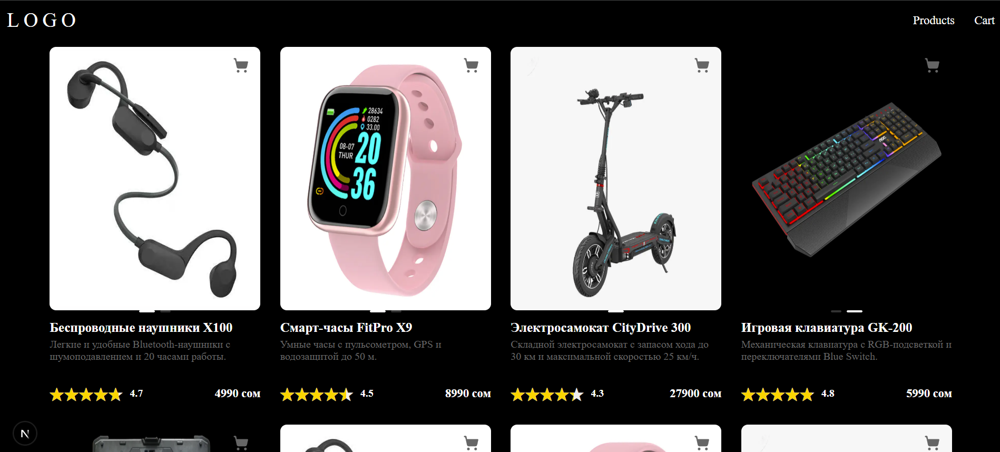

# ProductCart

Dark/Light mode



Первая версия, без поля amount: 
https://productys.netlify.app/products


Вторая более полная версия: 
https://deploy-preview-1--productys.netlify.app/products

ProductCart - это веб-приложение, реализующее минимальный функционал интернет-магазина. Пользователь может просматривать товары, добавлять их в корзину.

## Установка

Клонирование репозитории

```bash
git clone https://github.com/drtya/productCart.git
```

Установка зависимостей

```bash
npm install
```

Запуск

```bash
npm run dev
```

Перейти по ссылке - http://localhost:3000/


## Технологии

На основе данного проекста стоит архитектура FSD (Feature Slice Design) 
в папке src расположены слои 
- app - хронит глобальные стили, точку входа, роуты, контексты и тп.
- pagesLayout (пришлось назвать так из-за конфликтов App Route и pages Route в next js) - в данный слой предоставляет уже собранную страницу 
- features - кнопки и блоки которые выполняют какое либо действие изменяя бизнес сущность
- entity - в данном слое я храню запрос на получение данных и сторы, модели отдельных бизнес сущностей
- shared - uikit, оболочки запросов, модели не связанные с бизнесом но часто используемые, хелперы и тп.

antd - библиотека ui стилей, из которой использовалася слайдер, прочие ui компоненты хранятся в папке shared.
axios - для запросов на сервер, в данном случае /api/products.
next - фреймворк с удобным роутингом, хорошей сео оптимизацией, удобной работой с серверными экшенами и многим другим.
sass - для удобной работы с css стилями.
zustand - для удобного хранения и управления состояниями, плюс есть внутренний механизм кэширования, который невызывает лишних рендеров.
eslint - для чистоты кода

